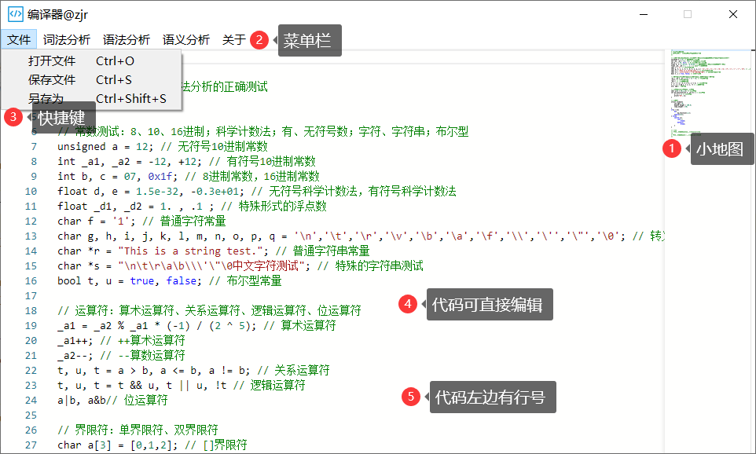
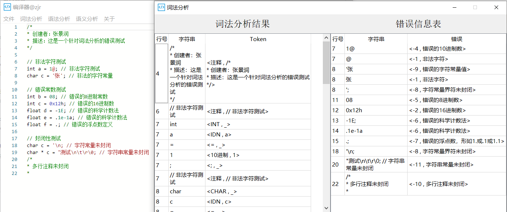
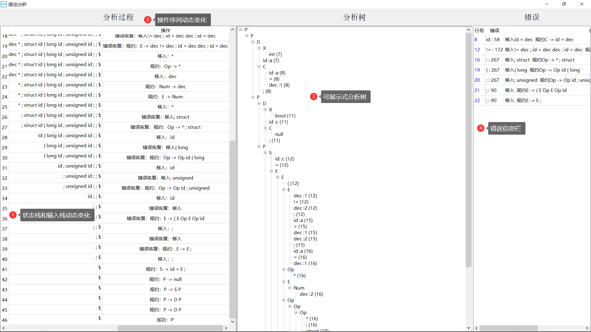
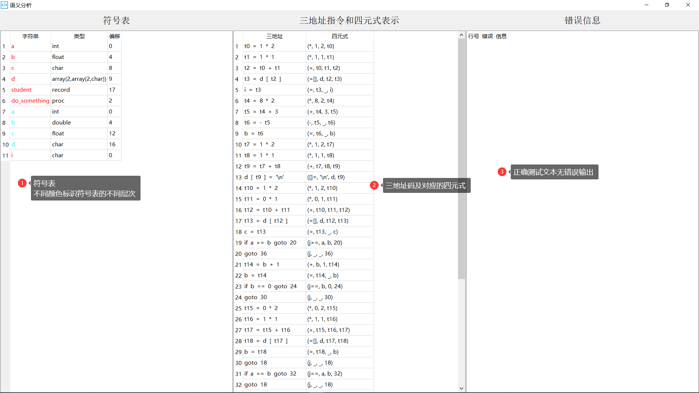

# 哈工大编译系统实验
## 写在前面
- 本次实验我花费了较长的时间完成，投入了较大的精力
- 由于1个人时间比较紧，所以实验2和实验3实现不够完美，尤其是实验3，存在着一些todo事项
- 编辑器用到了微软开源的Monaco，可能存在一些限制问题，望慎重使用
## 实验内容
- 实验一：词法分析器的设计与实现
  - 实现了所有功能
    - 基本功能：常数、界符、标识符、运算符、注释等
    - 附加功能：8进制、16进制、有符号、无符号科学计数法
    - 附加功能：NFA到DFA的转化、识别浮点数.1以及1.等形式
    - **重要功能**：转义符的处理，如char的一个'\n'，'\t'的声明等可以被正确识别
  - 识别能力强
    - 整体能力近似于真实的C语言词法编译器
    - 可以识别转义符\n \t \r \v \b \0等（这里花费了十分大的精力）
  - 精巧的DFA转换表设计，从零开始设计了42个状态，30个输入字符（集），工作量十分巨大（42*30）
  - 精巧设计的错误类型：设计了11个词法错误类型，错误识别精度很高
- 实验二：语法分析器的设计与实现
  - 实现了所有功能
    - 基本功能：声明、赋值、控制流、过程调用等
    - 附加功能：FIRST集、FOLLOW集、LR(1)分析表、错误识别和处理
    - 附加功能：GUI展示各种集合以及分析表、GUI展示分析树和错误信息
  - 识别能力强：由于实验一识别的Token序列粒度较细，所以需要拓展设计的LR(1)语法
- 实验三：语义分析器的设计与实现
  - 实现了所有基本功能
    - 基本功能：声明、赋值、控制流、过程调用等
    - 错误识别：变量或过程名重复声明、变量或过程名未声明、数组下标不是整数、对非数组使用数组操作符等
  - 识别能力强：由于实验一识别的Token序列粒度较细，所以需要拓展设计的LR(1)语法
## 文件说明
- vs文件夹：存放对开源工具Monaco的引用
- ui文件夹：存放自动生成的python gui文件（使用工具PyQtDesigner：上手阶段较为麻烦，但熟练后可提高生产力）
- input文件夹：存放输入的测试用例（测试样例设计较为用心，比较全面且有针对性）
  - [lexical_right_test.c](./input/lexical_right_test.c)：词法分析正确测试样例
  - [lexical_wrong_test.c](./input/lexical_wrong_test.c)：词法分析错误测试样例
  - [syntax_right_test.c](./input/syntax_right_test.c)：语义分析和语义分析正确测试样例
  - [syntax_wrong_test.c](./input/syntax_wrong_test.c)：语法分析错误测试样例
  - [semantic_wrong_test.c](./input/semantic_wrong_test.c)：语义分析错误测试样例
- help文件夹：存放设计的系统信息以及对Monaco工具的引用
  - [dfa.json](./help/dfa.json)：dfa自动机的输入状态信息
  - [syntax.json](./help/syntax.json)：语法分析的输入文法信息
  - [semantic.json](./help/semantic.json)：语义分析的输入文法信息
- [gui.py](./gui.py)：图形化界面程序，内有main函数
- [lexical.py](./lexical.py)：词法分析主要程序，内有主要逻辑
- [syntax.py](./syntax.py)：语法分析主要程序，内有主要逻辑
- [semantic.py](./semantic.py)：语义分析主要程序，内有主要逻辑
## 运行
- 环境：python3.6 Anaconda，pycharm IDE，将此仓库项目作为pycharm项目文件打开
- 如何运行
  - 运行gui.py程序即可进入到整体GUI界面
  - 菜单栏选择对应功能即可
  - 也可通过快捷键操作：文件操作（Ctrl+O、Ctrl+S、Ctrl+Shift+S）、词法分析运行Ctrl+F、语法分析运行Ctrl+F2以及语义分析运行Ctrl+F3
- 运行截图
  - 主界面：
  - 词法分析结果界面：
  - 语法分析结果界面：
  - 语义分析结果界面：
## 期望
- 欢迎后浪对仓库进行修改、优化
- 希望引用者对开源Monaco的版权相关问题表示注意